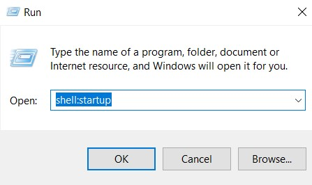

# setAffinity

A simple script to set the CPU affinity of audiodg.exe.
I use it to fix the crackling sound that my friends hear on discord when I use voicemeeter.

# Installation

1. download the script
2. search up run
3. open up the run dialog
4. type in `shell:startup`

5. put the script in the folder that opens up

Now everytime you start your computer the script will run and set the CPU affinity of audiodg.exe.
You will have to press yes on the prompt everytime it runs, but that is much preferable to using something like
ProcessLasso and having to wait 30 seconds everytime you restart.